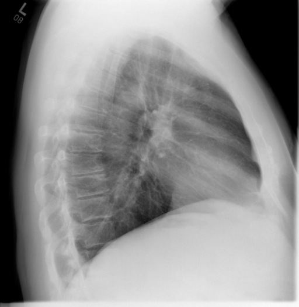
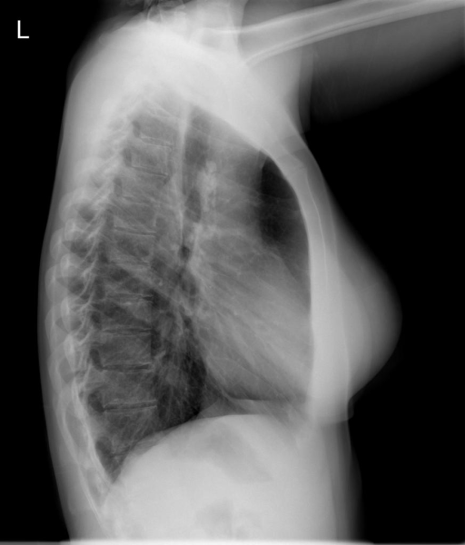

## XrayQwenVL

Xray Large Multi-model Model，基于QwenVL微调Xray的多模态大模型，在4张V100上基于qwenvl-chat模型微调。

 <p align="center">
      <a href='https://github.com/leeguandong/XrayQwenVL'>
            
      </a>
      <a href='https://github.com/leeguandong/XrayQwenVL'>
            
      </a>
      </br>
      <a href="https://github.com/leeguandong/XrayQwenVL/graphs/contributors">
        
      </a>
      <a href="https://github.com/leeguandong/XrayQwenVL/issues">
        
      </a>
      <a href="https://github.com/leeguandong/XrayQwenVL/pulls">
        
      </a>
      <a href=href="https://github.com/leeguandong/XrayQwenVL/stargazers">
        
      </a>
      <a href=href="https://github.com/leeguandong/XrayQwenVL">
        
      </a>
      </br>
      <a href=href="https://github.com/leeguandong/XrayQwenVL">
        
      </a>
      <a href=href="https://github.com/leeguandong/XrayQwenVL">
        
      </a>
      <a href="https://github.com/leeguandong/XrayQwenVL/blob/main/LICENSE">
        
      </a>
  </p>

## 本文贡献


- 借助Xray开源数据集，基于Qwenvl训练微调，并开放了用于学术研究的训练lora权重，推理时需要自行加载原始的qwenvl-chat权重，可借助tools/swift_infer_merge_lora.sh进行权重合并。
## 数据集

- [OpenI](https://openi.nlm.nih.gov/faq#collection)是一个来自印第安纳大学医院的胸部X光片数据集，包括6,459张图像和3,955个报告。

在上述工作中，报告信息都为非结构化的，不利于科学研究。为了生成合理的医学报告，我们对两个数据集进行了预处理，并最终得到了可以用于训练的**英文报告**。除此之外，为了更好的支持中文社区发展，借助ChatGPT的能力，我们将英文报告进行了中文翻译，并最终形成了可用于训练的数据集。

|数据集|数量|下载链接|质量|
|:-|:-|:-|:-|
|OpenI-zh|6,423|[诊疗报告(英文)](./data/openi-en.json)、[诊疗报告(中文)](./data/Xray/openi-zh.json) 、[X光影像](https://pan.baidu.com/s/13GBsDMKf6xBZBSHpoWH_EA?pwd=k9sh)|低|
|OpenI-zh-plus|6,423|-|高|

## 快速上手

### 1.安装环境
```bash
# Full capabilities
pip install 'ms-swift[all]' -U
# LLM only
pip install 'ms-swift[llm]' -U
# AIGC only
pip install 'ms-swift[aigc]' -U
# Adapters only
pip install ms-swift -U
```
### 2.模型推理

|模型权重|下载链接|质量|微调方法|
|:-|:-|:-|:-|
|checkpoints-XrayQwenVL-990|XrayQwenVL/results/qwenvl_swift_xray/qwen-vl-chat|低|LoRA|

#### CLI推理

```python
CUDA_VISIBLE_DEVICES=0 swift export \
  --ckpt_dir /home/e_commerce_lmm/results/qwenvl_swift_xray/qwen-vl-chat/v1-20240505-042908/checkpoint-990/ \
  --merge_lora true

CUDA_VISIBLE_DEVICES=0 swift infer \
  --ckpt_dir /home/e_commerce_lmm/results/qwenvl_swift_xray/qwen-vl-chat/v1-20240505-042908/checkpoint-990-merged \
  --load_dataset_config true
```
### 3.模型训练（复现XrayGLM）

<details>
  <summary>硬件资源</summary>
  <p>* 实验在V100 (4X, 32GB)上进行</p>
</details>


- （1）准备[诊疗报告(中文)](./data/openai-zh-swift-qwenvl-prompt.json)和[X光影像](https://pan.baidu.com/s/13GBsDMKf6xBZBSHpoWH_EA?pwd=k9sh)在`data/Xray`文件夹下；
- （2）开始训练：
```bash
sh tools/swift/swift_finetune_qwenvl_lora_ds.sh
```
这里的复现过程非常简单，主要是很多过程我们都为大家准备好了，大家可以随时复现一个自己的`XrayQwenVL`。

## 效果展示

*以下效果来自于**低质量**的数据训练和权重

影像诊断：
|X光影像|诊疗报告(医生)|XrayQwenVL|
|:-|:-|:-|
||患者的胸部X光片显示双侧肺部清晰，没有任何合并症、气胸或胸腔积液的迹象。心脏纵隔的轮廓和胸腔的骨质结构都在正常范围内。X光片的印象表明，没有急性心肺功能异常。这表明病人在这个时候有一个健康的呼吸和心血管系统。|X光片显示心脏大小正常，纵膈不明显。肺部看起来很清晰，没有急性疾病的证据。给人的印象是，没有急性疾病的发现。|
||X光片显示有陈旧性肉芽肿病的后遗症，但肺部清晰，没有任何局灶性固结、胸腔积液或气胸。心脏和纵膈的大小和轮廓正常，表明没有急性心肺功能异常。总的来说，这是一张清晰的胸部X光片。|X光片显示，心脏大小正常，纵隔无异常。肺部清晰，没有急性疾病。|
||研究结果表明，心脏大小和纵隔轮廓正常，肺部清晰，肺血管正常，没有胸腔积液或气孔。此外，观察到胸椎的退行性变化很小。根据印象，没有急性心肺异常的迹象。根据这些结果，病人的整体状况似乎是最佳的。|X光片显示，心脏大小正常，纵隔无异常。肺部清晰，没有急性疾病。|
||胸部X光片显示心脏和纵隔轮廓正常，气管旁区域有肉芽肿性钙化，右上叶有轻度条纹状瘢痕。没有发现活动性肺炎或气胸。骨骼结构完整。根据这些发现，没有大叶性肺炎存在。|X光片显示心脏大小正常，肺部清晰，没有气胸或胸腔积液的迹象。没有急性心肺疾病的影像学证据，因此是一张阴性的X光片。|

## 项目致谢

1. [XrayGLM](https://github.com/THUDM/VisualGLM-6B)为我们提供了数据集；
1. [SWIFT](https://github.com/modelscope/swift)为我们提供了训练框架；

## 免责声明

本项目相关资源仅供学术研究之用，严禁用于商业用途。使用涉及第三方代码的部分时，请严格遵循相应的开源协议。模型生成的内容受模型计算、随机性和量化精度损失等因素影响，本项目无法对其准确性作出保证。即使本项目模型输出符合医学事实，也不能被用作实际医学诊断的依据。对于模型输出的任何内容，本项目不承担任何法律责任，亦不对因使用相关资源和输出结果而可能产生的任何损失承担责任。

## 使用许可

此存储库遵循[CC BY-NC-SA](https://creativecommons.org/licenses/by-nc-sa/4.0/) ，请参阅许可条款。

